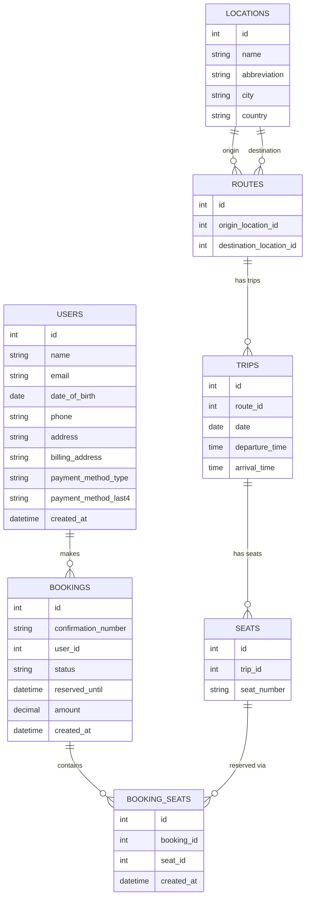

# Table of Contents

- [Local Dev](#local-dev)
- [DB Schema](#db-schema)
  - [locations](#locations---a-table-to-store-location-information)
  - [routes](#routes---a-table-to-store-route-information)
  - [trips](#trips---a-table-to-store-trip-information)
  - [seats](#seats---a-table-to-store-seat-information)
  - [bookings](#bookings---a-table-to-store-booking-information)
  - [booking_seats](#booking_seats---a-join-table-for-bookings-and-seats)
  - [users](#users---a-table-to-store-user-and-billing-info)
- [ERD](#erd)
- [Routes](#routes)
  - [Application Routes](#application-routes)
  - [API Routes](#api-routes)

## Local Dev

To get started with local development:

1. Install dependencies:

```bash
pnpm install
```

2. Start the PostgreSQL database:

```bash
pnpm db:up
```

3. Run database migrations:

```bash
pnpm db:migrate
```

4. Seed the database with initial data:

```bash
pnpm db:seed
```

5. Run the development server:

```bash
pnpm dev
```

6. Open [http://localhost:3000](http://localhost:3000) with your browser to see the result.

When you're done developing, you can stop the database with:

```bash
pnpm db:down
```

## DB Schema

#### locations - a table to store location information

relations

- **1:M with routes (as origin)**  
  One location can be the origin for many routes.
- **1:M with routes (as destination)**  
  One location can be the destination for many routes.

#### routes - a table to store route information

relations

- **M:1 with locations (origin)**  
  Each route has one origin location.
- **M:1 with locations (destination)**  
  Each route has one destination location.
- **1:M with trips**  
  One route can have many scheduled trips.

#### trips - a table to store trip information

relations

- **M:1 with routes**  
  Each trip belongs to one route.
- **1:M with seats**  
  One trip contains many seats.

#### seats - a table to store seat information

relations

- **M:1 with trips**  
  Each seat belongs to one trip.
- **M:M with bookings via booking_seats**  
  Each seat can be linked to multiple bookings over different trips, but for a given trip, a seat can only be reserved once.

#### bookings - a table to store booking information

relations

- **M:1 with users**  
  A booking is made by one user.
- **M:M with seats via booking_seats**  
  A booking can hold one or multiple seats through the join table.

#### booking_seats - a join table for bookings and seats

relations

- **M:1 with bookings**  
  Each row links one seat to one booking.
- **M:1 with seats**  
  Each row references a single seat.
- **Unique constraint**  
  Ensures a seat is only booked once per trip while allowing multiple seats per booking.

#### users - a table to store user and billing info

relations

- **1:M with bookings**  
  A user can have many bookings.

## ERD



## Routes

#### Application Routes

`/` – Root search page

- User selects origin, destination, date
- Requires all fields before showing results
- **Query params:** `from`, `to`, `date`

`/trip/[tripId]` – Trip detail page

- Shows seat layout and availability
- User selects seats and enters passenger information (name, email, date of birth)
- Submitting the form creates a user and a reserved booking, then redirects to payment

`/trip/[tripId]/payment` – Payment page

- Handles payment for the reserved booking
- Shows trip information, selected seats, passenger details, and payment form
- Displays reservation expiration timer
- **Query params:** `bookingId`

`/confirmation/[confirmationNumber]` – Confirmation page

- Shown after successful payment
- Displays booking confirmation with confirmation number

`*` – Not found

- Fallback for unmatched routes

#### API Routes

`api/cron/cleanup-bookings` – Clear expired reservations

- Removes bookings in reserved status older than half an hour
- Resets them to open
