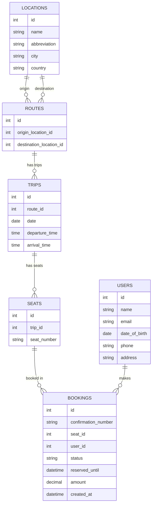

This is a [Next.js](https://nextjs.org) project bootstrapped with [`create-next-app`](https://nextjs.org/docs/app/api-reference/cli/create-next-app).

## Local Dev

To get started with local development:

1. Install dependencies:
```bash
pnpm install
```

2. Start the PostgreSQL database:
```bash
pnpm db:up
```

3. Run the development server:
```bash
pnpm dev
```

4. Open [http://localhost:3000](http://localhost:3000) with your browser to see the result.

When you're done developing, you can stop the database with:
```bash
pnpm db:down
```


## locations
**Fields**
- id
- name
- abbreviation
- city
- country
**Relationships**
- **1:M with routes (as origin)**  
    One location can be the origin for many routes.
- **1:M with routes (as destination)**  
    One location can be the destination for many routes.
---
## routes
**Fields**
- id
- origin_location_id
- destination_location_id

**Relationships**
- **M:1 with locations (origin)**  
    Each route has one origin location.
- **M:1 with locations (destination)**  
    Each route has one destination location.
- **1:M with trips**  
    One route can have many scheduled trips.
---
## trips
**Fields**
- id
- route_id
- date
- departure_time
- arrival_time
**Relationships**
- **M:1 with routes**  
    Each trip belongs to one route.
- **1:M with seats**  
    One trip contains many seats.
---
## seats
**Fields**
- id
- trip_id
- seat_number
**Relationships**
- **M:1 with trips**  
    Each seat belongs to one trip.
- **1:M or M:M with bookings (depending on model)**  
    Commonly: one seat can appear in multiple bookings only across different trips; for a given trip, one seat has at most one booking.

---
## bookings
**Fields**
- id
- confrimation_number
- seat_id
- user_id
- status (reserved, booked, canceled)
- reserved_until
- amount, 
- created_at
**Relationships**
- **M:1 with seats**  
    A booking reserves one specific seat.
- **M:1 with users**  
    A booking is made by one user.
(If you want multi-passenger bookings, you’d add linking tables, but this reflects your original model.)

---
## users
**Fields**
- id
- name
- email
- date of birth
- phone
- address
**Relationships**
- **1:M with bookings**  
    A user can have many bookings.


#### Application Routes
`/` – Root search page
- User selects origin, destination, date
- Requires all fields before showing results  
    **Query params:** `from`, `to`, `date`
 
 `/trip/[tripId]` – Trip detail
- Shows seat layout and availability
- User selects seat count and sees cost
- Enter name, email, date of birth
- Checkout creates a user and a reserved booking

`/trip/[tripId]/payment` – Payment page
- Handles payment for the reserved booking

`/trip/[tripId]/checkout` – Review page
- Shown after successful payment
- Displays confirmation info
 
 `*` – Not found
- Fallback for unmatched routes

#### API Routes
 `/cron/seat` – Clear expired reservations
- Removes bookings in reserved status older than one hour
- Resets them to open

### thoughts
2 
- API Structure
	Show structure
	Talk about having the fewest pages possible, search -> directly to entering info => payment info. A user will start submitting info before they realize they are in the flow.
- How does it submit bookings
- How we fetch search data
	using a form that controls the query params 
3 Concurrence 
Selecting seats at the same time you enter basic user info allows you to connect a booking with reserved status to a specific seat. 

should select seats and enter details in order to connect a user to a reserved seat
- Need to associate a user with a seat for a reserved status so that other people cant use my reserved seat
- We only have to search Booking to remove it from the cron
Cron 
- a way to remove reserved bookings
- schedules and api route to be hit configurable once every hour	

## SEED DATA
seats
```json
[
  "A1", "A2", "A3", "A4",
  "B1", "B2", "B3", "B4",
  "C1", "C2", "C3", "C4",
  "D1", "D2", "D3", "D4",
  "E1", "E2", "E3", "E4",
  "F1", "F2", "F3", "F4",
  "G1", "G2", "G3", "G4",
  "H1", "H2", "H3", "H4",
  "I1", "I2", "I3", "I4",
  "J1", "J2", "J3", "J4",
  "K1", "K2", "K3", "K4",
  "L1", "L2", "L3", "L4"
]

taken:
["C2", "F4", "A1", "H3", "D1", "K2", "B4"]

```

graph connections
```json
{
  "EWR": ["LGA","JFK","BUF","BOS","PHL","BWI","DCA","IAD","RDU","CHS"],
  "LGA": ["EWR","JFK","BUF","BOS","PHL","BWI","DCA","IAD","RDU","JAX"],
  "JFK": ["EWR","LGA","BUF","BOS","PHL","BWI","DCA","IAD","CHS","MIA"],
  "BUF": ["EWR","LGA","JFK","BOS","PHL","BWI","DCA","IAD","JAX","MIA"],
  "BOS": ["EWR","LGA","JFK","BUF","PHL","BWI","DCA","IAD","CLT","RDU"],
  "PHL": ["EWR","LGA","JFK","BUF","BOS","BWI","DCA","IAD","CLT","CHS"],
  "BWI": ["EWR","LGA","JFK","BUF","BOS","PHL","DCA","IAD","CLT","JAX"],
  "DCA": ["EWR","LGA","JFK","BUF","BOS","PHL","BWI","IAD","RDU","MIA"],
  "IAD": ["EWR","LGA","JFK","BUF","BOS","PHL","BWI","DCA","CHS","JAX"],
  "CLT": ["RDU","CHS","JAX","MIA","BOS","PHL","BWI"],
  "RDU": ["CLT","CHS","JAX","MIA","EWR","LGA","BOS","DCA"],
  "CHS": ["CLT","RDU","JAX","MIA","EWR","JFK","PHL","IAD"],
  "JAX": ["CLT","RDU","CHS","MIA","LGA","BUF","BWI","IAD"],
  "MIA": ["CLT","RDU","CHS","JAX","JFK","BUF","DCA"]
}
```

locations
```json
[
  { "name": "Newark Liberty International Airport", "abbreviation": "EWR" },
  { "name": "LaGuardia Airport", "abbreviation": "LGA" },
  { "name": "John F. Kennedy International Airport", "abbreviation": "JFK" },
  { "name": "Buffalo Niagara International Airport", "abbreviation": "BUF" },
  { "name": "Boston Logan International Airport", "abbreviation": "BOS" },
  { "name": "Philadelphia International Airport", "abbreviation": "PHL" },
  { "name": "Baltimore Washington International Airport", "abbreviation": "BWI" },
  { "name": "Ronald Reagan Washington National Airport", "abbreviation": "DCA" },
  { "name": "Washington Dulles International Airport", "abbreviation": "IAD" },
  { "name": "Charlotte Douglas International Airport", "abbreviation": "CLT" },
  { "name": "Raleigh Durham International Airport", "abbreviation": "RDU" },
  { "name": "Charleston International Airport", "abbreviation": "CHS" },
  { "name": "Jacksonville International Airport", "abbreviation": "JAX" },
  { "name": "Miami International Airport", "abbreviation": "MIA" }
]
```


Schedule
```json
[
  {"departure":"2025-12-04T06:00","arrival":"2025-12-04T07:30"},
  {"departure":"2025-12-04T08:00","arrival":"2025-12-04T09:30"},
  {"departure":"2025-12-04T10:00","arrival":"2025-12-04T11:30"},
  {"departure":"2025-12-04T12:00","arrival":"2025-12-04T13:30"},
  {"departure":"2025-12-04T14:00","arrival":"2025-12-04T15:30"},
  {"departure":"2025-12-04T16:00","arrival":"2025-12-04T17:30"}
]
```
# landline
