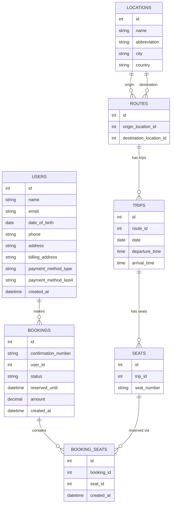

# Table of Contents

- [Local Dev](#local-dev)
- [Architecture Overview](#architecture-overview)
  - [Database Schema](#database-schema)
    - [Overview](#overview)
    - [locations, routes, trips, and seats](#locations-routes-trips-and-seats)
    - [bookings, seats, and users](#bookings-seats-and-users)
    - [Cancellations, changes, and booking modifications](#cancellations-changes-and-booking-modifications)
  - [API Structure](#api-structure)
    - [Overview](#overview-1)
    - [Fetching Availability](#fetching-availability)
    - [Submit Bookings](#submit-bookings)
  - [Concurrency](#concurrency)
    - [Handling Reserved Booking Timeouts](#handling-reserved-booking-timeouts)

## Local Dev

To get started with local development:

1. Install dependencies:

```bash
pnpm install
```

2. Start the PostgreSQL database:

```bash
pnpm db:up
```

3. Run database migrations:

```bash
pnpm db:migrate
```

4. Seed the database with initial data:

```bash
pnpm db:seed
```

5. Run the development server:

```bash
pnpm dev
```

6. Open [http://localhost:3000](http://localhost:3000) with your browser to see the result.

When you're done developing, you can stop the database with:

```bash
pnpm db:down
```

# Architecture Overview

## Database Schema

Below covers the response to the first concern, the database schema answering the following questions:

> Database Schema: How are you modeling Routes, Schedules, Inventory (seats), and
> Reservations? How you handle cancellations, changes, and booking modifications?

### Overview



### locations, routes, trips, and seats.

Locations, Routes, Trips, and Seats are all their own tables.

Routes connect one origin location to a destination location. Keeping locations in a separate table keeps the schema normalized and flexible as the system grows.

Trips are the scheduled instances of routes. A route outlines the general path, while a trip provides specifics such as date and time. This is preferable because it eliminates the need to duplicate origin and destination pairs for each trip and separates the routes themselves from the calendar/inventory. Seats are tied to a specific trip and represent the inventory for that trip.

### bookings, seats, and users

One trip provides inventory through seats, and each row in the seats table represents a single unit of that inventory. Modeling inventory this way allows us to avoid hard-coding seat counts or storing seats directly in a trip row in something like a JSONB column. With seats stored individually, availability logic can be enforced at the database level. Additionally, releasing inventory in this way could be quite flexible in that you can have buses with different seat layouts or pricing.

Bookings express the purchase or reservation of a specific seat or seats. The bookings_seats join table links the bookings to the seats, allowing us to express a many-to-many relationship where a single booking can purchase or reserve many seats.

### Cancellations, changes, and booking modifications

Bookings are modeled to have a `booking_status` as a PostgreSQL enum: `reserved`, `booked`, or `canceled`. When a user goes to checkout, a booking is created with a `reserved` status. If the booking is canceled, its status changes to `canceled`, and the related rows in the `bookings_status` table are removed. The `bookings_seats` table has a unique constraint on the `seats_id` column, preventing a single inventory seat from being booked more than once. This approach maintains `bookings_seats` to serve as an accurate record of seat availability.

## API Structure

> API Structure: How does the frontend fetch availability and submit bookings?

### Overview

#### Application Routes

`/` – Root search page

- User selects origin, destination, and date
- Requires all fields before showing results
- **Query params:** `from`, `to`, `date`

`/trip/[tripId]` – Trip detail page

- Shows seat layout and availability
- User selects seats and enters passenger information (name, email, date of birth)
- Submitting the form creates a user and a reserved booking, then redirects to payment

`/trip/[tripId]/payment` – Payment page

- Handles payment for the reserved booking
- Shows trip information, selected seats, passenger details, and payment form
- Displays reservation expiration timer
- **Query params:** `bookingId`

`/confirmation/[confirmationNumber]` – Confirmation page

- Shown after successful payment
- Displays booking confirmation with confirmation number

#### API Routes

`api/cron/cleanup-bookings` – Clear expired reservations (set to 30 min)

- Removes bookings in reserved status older than half an hour
- Resets them to open

### Fetching Availability

Availability is fetched in 2 main routes. In the root when searching for trips and in the `/trip/[tripId]` page.

In the search page or wherever search data is pulled, availability is determined by a record in the join table `bookings_seats` that implies that the seat is reserved or booked. In the queries for this data, we join on this table to infer whether the seat is available or not.

In the UI, if you go to `/trip/[tripId]` and click through to purchase, you will reserve that seat, then if you navigate back to the same page, you will see that that check box is disabled.

On the root search page (`src/app/page.tsx`), I leverage Next.js and React Server Components to implement progressive streaming. The server component initiates the database query for search results without awaiting the promise. Instead, it passes the unresolved promise across a Suspense boundary to the `SearchResultsList` component, which then awaits the data. This allows the server to respond with static content (the search form, heading, and loading skeleton) immediately, while the search results are streamed as they become available. This reduces perceived page load times by delivering content progressively, even before the main data fetching function completes.

### Submit Bookings

On the `/trip/[tripId]` page, a user selects a seat and enters their name, email, and date of birth. This form triggers a server action that starts a database transaction that creates a user, a booking, and implies ownership over specific seats through the `bookings_seats` table. When the transaction is completed, the user is redirected to `/trip/[tripId]/payment` with a search param `?bookingId=[bookingId]`.

On the payment page, information for the trip is displayed, such as the trip origin, destination, cost, and other details. Here, the user inputs their credit or debit details and submits payment through a server function. If the process succeeds, they will be redirected to the `/confirmation/[confirmationNumber]` page, which displays the confirmation number for the booked trip.

## Concurrency

> Concurrency: How do you ensure you don't sell the same seat to two people at the
> exact same time?

Bookings are created reserved state and stay that way until they expire or until payment is complete. The bookings table uses an enum for `reserved`, `booked`, and `canceled`. Reserved bookings expire after 30 minutes if payment isn’t completed.

Seats represent individual entities, with each row corresponding to a single seat related to a specific trip. Maintaining individual seat rows enforces ownership directly at the database level. This is accomplished through the `booking_seats` join table, which links bookings to seats and applies a unique constraint on `seat_id`, ensuring one seat cannot be linked to multiple bookings.

When a user selects a seat and proceeds to checkout, a row for the user, a booking, and the requested seats are linked to the booking via `bookings_seats`. This process is executed within a transaction to ensure atomicity. During the transaction, the system verifies whether the requested seats are available, and if not, the transaction is aborted.

During the transaction, the relevant `bookings_seats` and `seats` rows are locked, preventing modification by others while the transaction processes, forcing other transactions accessing the same seats to wait. This prevents double bookings.

The same transactional process applies during payment. If the payment fails, the database update is also rolled back. The booking entry is locked to prevent duplicate payment attempts.

### Handling Reserved Booking Timeouts

On the `/trip/[tripId]` page, users enter information and select their seat. This process creates a user and bookings. The initial booking receives a `booking_status` of `reserved`, along with a `reserved_until` field set to 30 minutes from the time of booking. The server action then redirects the user to the payment page, which displays the deadline for completing payment.

If payment is attempted after expiration, the server action produces an error indicating the reservation has expired. To release seats, a cron job at `/api/cron/cleanup-bookings` queries the database for expired reserved bookings and removes them to free the seats.

With deployment on Vercel, setting up cron jobs is straightforward. The cron job is an API route protected by an environment variable key and configured to run via the `vercel.json` file in the project root.

- Note: The demo application is using the Vercel Free Plan with limited cron executions per day. Due to this I have the cron set set to once daily.
