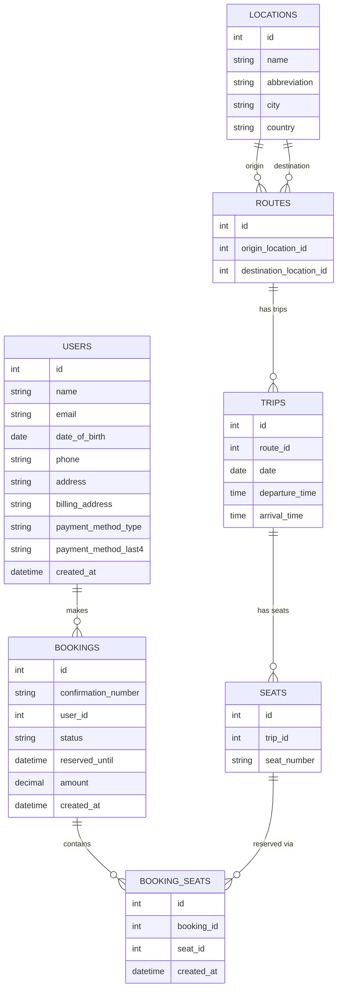

## locations

**Fields**

- id
- name
- abbreviation
- city
- country

#### Relationships

- **1:M with routes (as origin)**  
   One location can be the origin for many routes.
- **1:M with routes (as destination)**  
   One location can be the destination for many routes.

## routes

**Fields**

- id
- origin_location_id
- destination_location_id

#### Relationships

- **M:1 with locations (origin)**  
   Each route has one origin location.
- **M:1 with locations (destination)**  
   Each route has one destination location.
- **1:M with trips**  
   One route can have many scheduled trips.

## trips

**Fields**

- id
- route_id
- cost
- date
- departure_time
- arrival_time

#### Relationships

- **M:1 with routes**  
   Each trip belongs to one route.
- **1:M with seats**  
   One trip contains many seats.

## seats

**Fields**

- id
- trip_id
- seat_number

#### Relationships

- **M:1 with trips**  
   Each seat belongs to one trip.
- **M:M with bookings via booking_seats**  
   Each seat can be linked to multiple bookings over different trips, but for a given trip, a seat can only be reserved once.

## bookings

**Fields**

- id
- confirmation_number
- user_id
- status (reserved, booked, canceled)
- reserved_until
- amount
- created_at

#### Relationships

- **M:1 with users**  
   A booking is made by one user.
- **M:M with seats via booking_seats**  
   A booking can hold one or multiple seats through the join table.

## booking_seats

**Fields**

- id
- booking_id
- seat_id
- created_at

#### Relationships

- **M:1 with bookings**  
   Each row links one seat to one booking.
- **M:1 with seats**  
   Each row references a single seat.
- **Unique constraint**  
   Ensures a seat is only booked once per trip while allowing multiple seats per booking.

## users

**Fields**

- id
- name
- email
- date of birth
- phone
- address
- billing_address
- payment_method_type (credit, debit, etc.)
- payment_method_last4
- created_at

#### Relationships

- **1:M with bookings**  
   A user can have many bookings.

